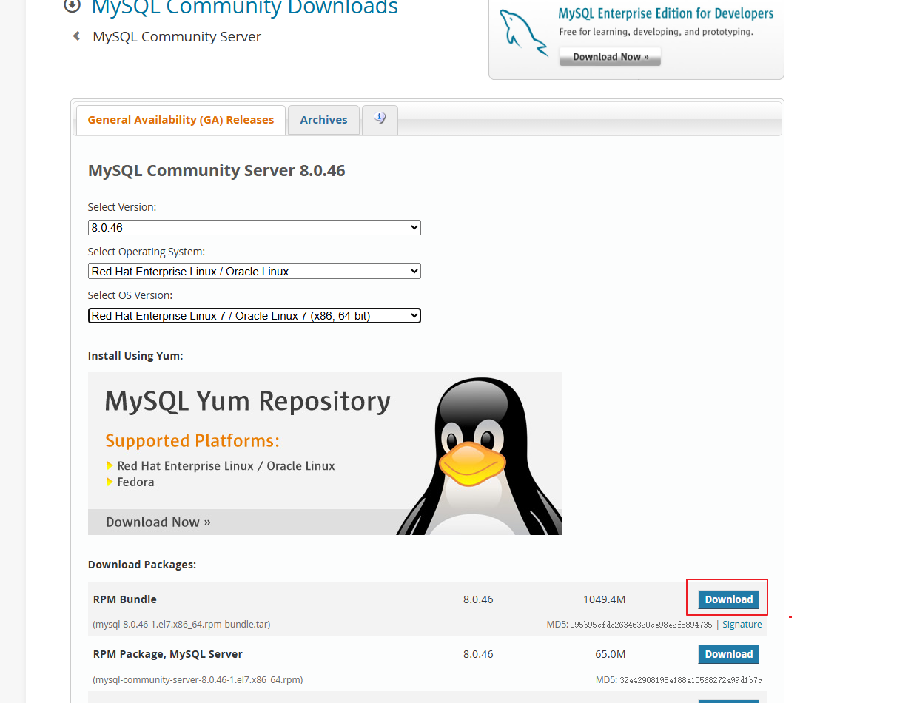
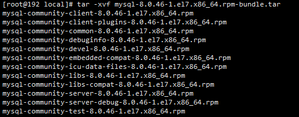

# MySQL 安装步骤
下载地址：https://dev.mysql.com/downloads/mysql/




解压

```
tar -xvf mysql-8.0.46-1.el7.x86_64.rpm-bundle.tar
```




按顺序安装

```sh
rpm -e --nodeps mariadb-libs-5.5.68-1.el7.x86_64

rpm -ivh mysql-community-common-8.0.46-1.el7.x86_64.rpm
rpm -ivh mysql-community-client-plugins-8.0.46-1.el7.x86_64.rpm
rpm -ivh mysql-community-libs-8.0.46-1.el7.x86_64.rpm
rpm -ivh mysql-community-libs-compat-8.0.46-1.el7.x86_64.rpm
rpm -ivh mysql-community-client-8.0.46-1.el7.x86_64.rpm 
rpm -ivh mysql-community-icu-data-files-8.0.46-1.el7.x86_64.rpm
rpm -ivh mysql-community-server-8.0.46-1.el7.x86_64.rpm

mysql --version
```


MySQL不区分表名、数据库名和数据库模式名的大小写，需要先加lower_case_table_names=1,mysql8只能初始化的时候配置，后面修改比较麻烦

```sh
vi /etc/my.cnf
```

```cnf
datadir=/var/lib/mysql
socket=/var/lib/mysql/mysql.sock
lower_case_table_names=1

log-error=/var/log/mysqld.log
pid-file=/var/run/mysqld/mysqld.pid
```


```sh
systemctl status mysqld

systemctl start mysqld

systemctl stop mysqld

systemctl restart mysqld
```


初次启动mysql后，获取root的初始密码

```sh
cat /var/log/mysqld.log | grep root@localhost
```

登录mysql

```sh
mysql -u root -p
```

修改密码，开放远程调用

```mysql
ALTER USER 'root'@'localhost' IDENTIFIED BY 'Admin@123456!';

use mysql;
UPDATE user SET host='%' WHERE user='root' AND host='localhost';
FLUSH PRIVILEGES;
```

```cnf
[mysqld]
bind-address = 0.0.0.0
```

mysql8默认强密码，如果需要使用简单密码则需配置：

```cnf
[mysqld]
validate_password.policy=LOW
validate_password.length=6
```

```mysql
ALTER USER 'root'@'%' IDENTIFIED BY '123456';
FLUSH PRIVILEGES;
```
