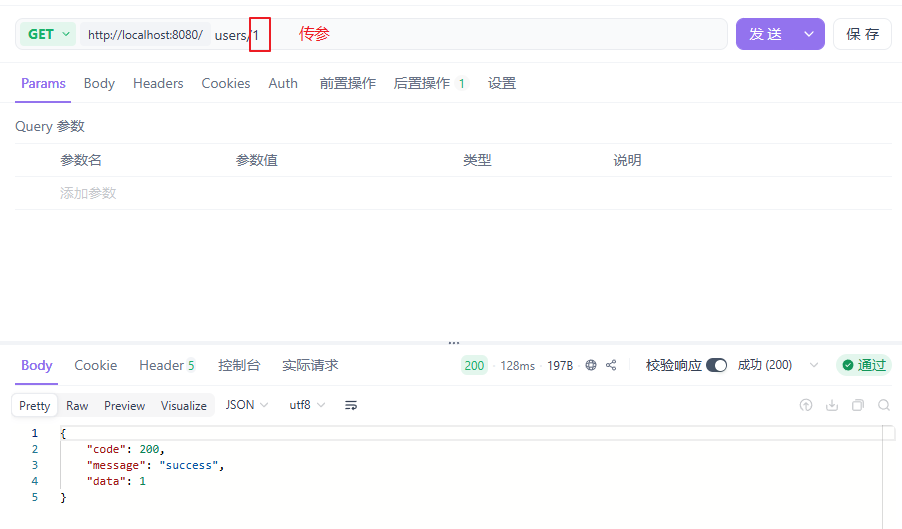
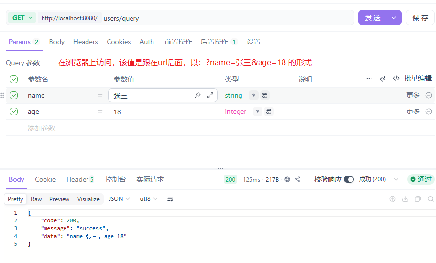
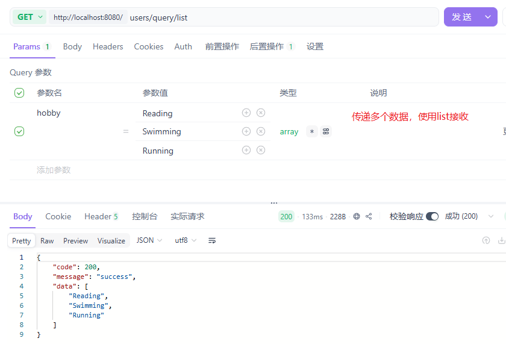
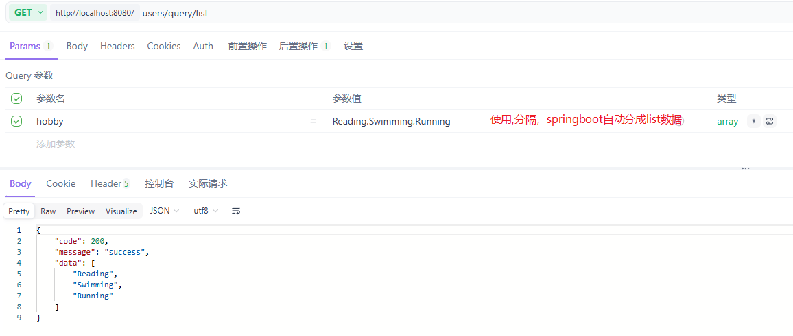
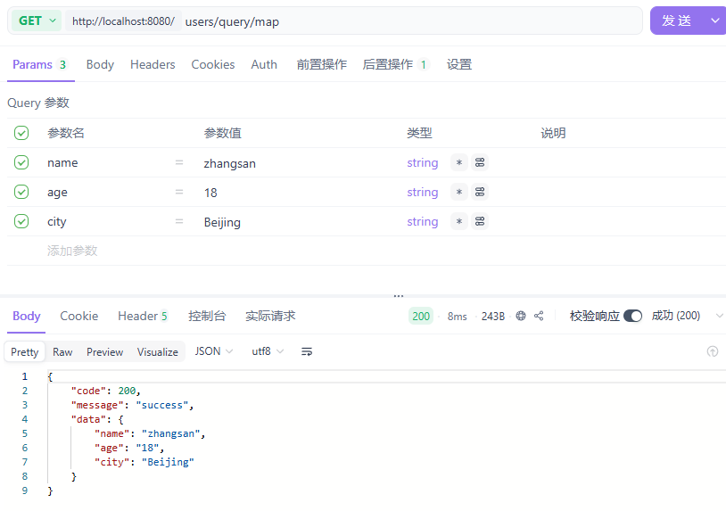
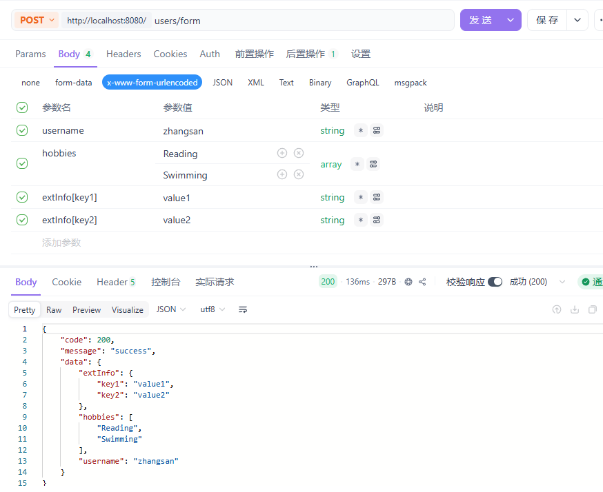
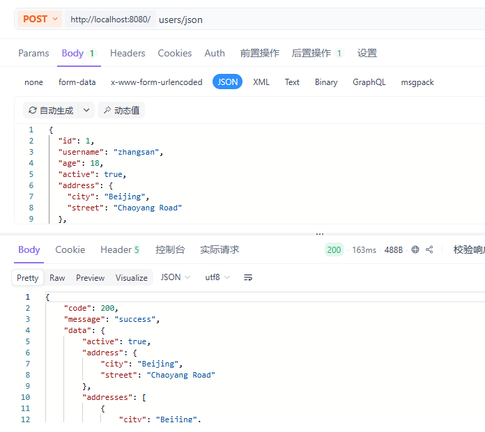
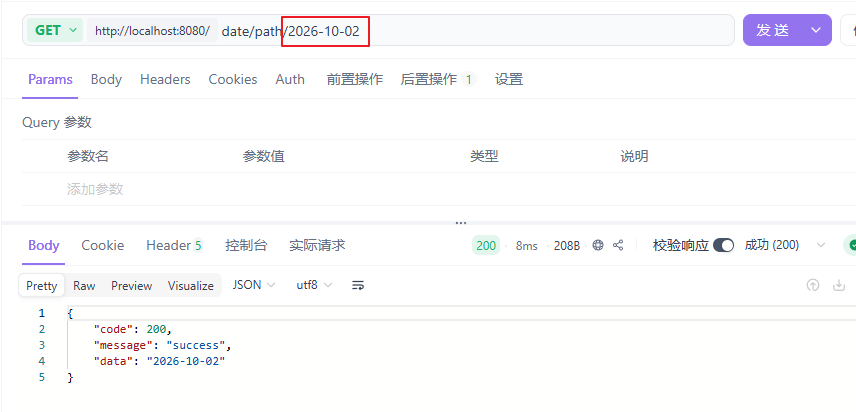
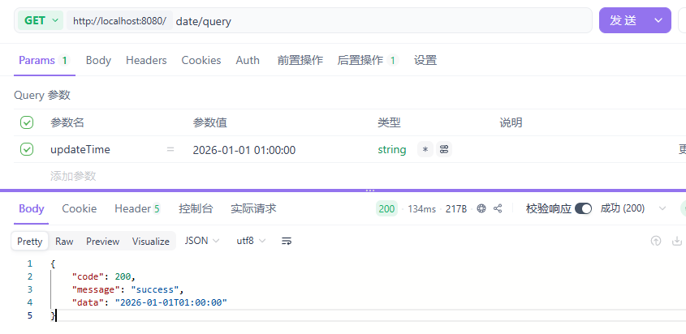
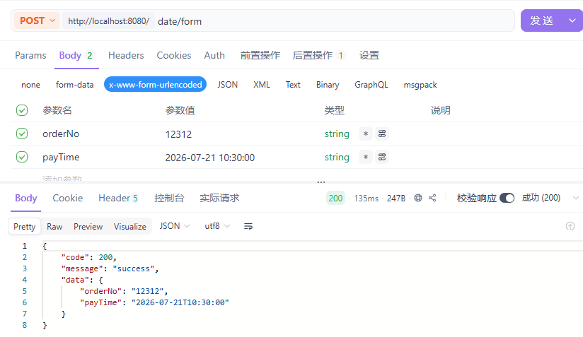

# 参数接收
::: important 说明
本文以 Apifox + Spring Boot​ 为例，系统性讲解 HTTP 请求参数在 Controller 中的所有接收方式，包括 URI 参数、Query 参数、JSON 请求体、表单参数，并结合实际请求示例与常见错误，帮助你在开发中少踩 80% 的参数坑。
:::

## 背景：解决了什么问题

在 Spring Boot Web 开发中，参数接收是第一道门槛。

新手常遇到的困惑：

- 什么时候用 `@RequestParam`？什么时候用 `@RequestBody`？
- POST 请求为什么接收不到 JSON？
- List 和 Map 怎么接？
- 对象里面包对象、包 List，前端该怎么传？

这些问题如果理解不透彻，会导致：

- 接口调用失败
- 参数绑定异常（400 Bad Request）
- 前后端联调成本飙升

本文的目标就是：**一次性把这些场景彻底讲清楚，并提供可直接复制的代码。**


## 核心概念与注解总览

### 参数位置

| **参数位置**   | **典型场景**     |
| :------------- | :--------------- |
| URI 路径       | REST 风格 URL    |
| Query 参数     | 查询、分页、过滤 |
| 请求体（JSON） | 新增、修改       |
| 请求体（表单） | 表单提交         |
| Header         | 鉴权、设备信息   |
| Cookie         | 登录态           |

### Spring MVC 相关注解

| **注解**          | **作用**                 |
| :---------------- | :----------------------- |
| `@PathVariable`   | 从 URI 中取参数          |
| `@RequestParam`   | 从 Query / Form 中取参数 |
| `@RequestBody`    | 从请求体（JSON）中取参数 |
| `@ModelAttribute` | 表单参数自动封装         |
| `@RequestHeader`  | 从 Header 中取参数       |
| `@CookieValue`    | 从 Cookie 中取参数       |


## 环境准备

::: details pom.xml
```xml
<dependency>
    <groupId>org.springframework.boot</groupId>
    <artifactId>spring-boot-starter-web</artifactId>
</dependency>

<dependency>
    <groupId>org.projectlombok</groupId>
    <artifactId>lombok</artifactId>
    <optional>true</optional>
</dependency>
```
:::


::: details 统一返回结果
```java
@Data
@AllArgsConstructor
@NoArgsConstructor
public class Result<T> {
    private int code;
    private String message;
    private T data;

    public static <T> Result<T> ok(T data) {
        return new Result<>(200, "success", data);
    }
}
```
:::


## 核心功能详解

### URI 路径参数

> 核心注解：@PathVariable
>
> 使用场景：REST 风格查询单个资源


::: details controller
```java
@RestController
@RequestMapping("/users")
public class ParamController {
    
    @GetMapping("/{id}")
    public Result<Long> getById(@PathVariable Long id) {
        return Result.ok(id);
    }

}
```
:::

apifox



### Query 参数

> 核心注解：@RequestParam
>
> 使用场景：查询、分页、过滤

::: details controller
```java
	@GetMapping("/query")
	public Result<String> query(
        @RequestParam String name,
        @RequestParam(defaultValue = "18") Integer age) {
    	return Result.ok("name=" + name + ", age=" + age);
	}

	@GetMapping("/query/list")
    public Result<List<String>> queryList(
    	@RequestParam("hobby") List<String> hobbies) {
        return Result.ok(hobbies);
    }
	// 不能使用Map<String,Object>来接收
	@GetMapping("/query/map")
	public Result<Map<String, String>> queryMap(
		@RequestParam Map<String, String> params) {
    	return Result.ok(params);
	}
```
:::

apifox

前端正常传参




前端传递多个相同的key，后端使用list接收




前端传递一个key，对应的value值使用 ',' 分隔，后端使用list接收




前端正常传参，使用map接收参数




### 表单数据

> @ModelAttribute
>
> 使用场景：传统表单提交

::: details pojo
```java
@Data
public class User {
    private String username;
    private List<String> hobbies;
    private Map<String, String> extInfo;
}
```
:::

::: details controller
```java
@PostMapping("/form")
public Result<User> formSubmit(User form) {
    return Result.ok(form);
}
```
:::

apifox




### JSON 请求体

> 核心注解：@RequestBody
>
> 使用场景：前端使用json格式传参

::: details pojo
```java
@Data
public class Address {
    private String city;
    private String street;
}
```
:::


::: details pojo
```java
@Data
public class UserVO {
    // 1. 基本数据类型
    private Long id;
    private String username;
    private Integer age;
    private Boolean active;

    // 2. 其他类（嵌套对象）
    private Address address;

    // 3. List 集合（基本类型）
    private List<String> hobbies;

    // 4. List 集合（对象类型）
    private List<Address> addresses;

    // 5. Map 集合
    private Map<String, String> extInfo;
}
```
:::

::: details controller
```java
@PostMapping("/json")
public Result<UserVO> receiveJson(@RequestBody UserVO userVO) {
    return Result.ok(userVO);
}
```
:::

apifox




## 特殊情况

### 参数为日期格式

#### Query 参数 / Form 表单（非 JSON）

> 核心注解：@DateTimeFormat

::: details controller
```java
@RestController
@RequestMapping("/date")
public class DataController {
    /**
     * Query 参数接收日期
     */
    @GetMapping("/query")
    public Result<LocalDateTime> queryDate(
            @RequestParam
            @DateTimeFormat(pattern = "yyyy-MM-dd HH:mm:ss")
            LocalDateTime updateTime) {

        return Result.ok(updateTime);
    }

    /**
     * URI 路径参数接收日期
     */
    @GetMapping("/path/{date}")
    public Result<LocalDate> pathDate(
            @PathVariable("date")
            @DateTimeFormat(pattern = "yyyy-MM-dd")
            LocalDate date) {

        return Result.ok(date);
    }
}
```
:::

::: tip 注意
前端传的字符串必须严格匹配 pattern，否则会报 400 TypeMismatch。
:::
uri路径上传参



query上传参



#### 表单提交

> 核心注解：@DateTimeFormat

::: details pojo
```java
@Data
public class DateForm {
    private String orderNo;

    @DateTimeFormat(pattern = "yyyy-MM-dd HH:mm:ss")
    private LocalDateTime payTime;
}
```
:::

::: details controller
```java
@PostMapping("/form")
public Result<DateForm> formDate(DateForm form) {
    return Result.ok(form);
}
```
:::



#### JSON 请求体

> 核心注解：@JsonFormat

::: warning 注意

@DateTimeFormat 对 @RequestBody 的 JSON 不生效，JSON 反序列化是 Jackson 负责的，必须用 @JsonFormat

:::

::: details pojo
```java
@Data
public class UserVO {
    // 1. 基本数据类型
    private Long id;
    private String username;
    private Integer age;
    private Boolean active;

    // 2. 其他类（嵌套对象）
    private Address address;

    // 3. List 集合（基本类型）
    private List<String> hobbies;

    // 4. List 集合（对象类型）
    private List<Address> addresses;

    // 5. Map 集合
    private Map<String, String> extInfo;

    @JsonFormat(pattern = "yyyy-MM-dd HH:mm:ss", timezone = "GMT+8")
    private LocalDateTime birthday;

    @JsonFormat(pattern = "yyyy-MM-dd", timezone = "GMT+8")
    private LocalDate registerDate;
}
```
:::

::: details controller
```java
@PostMapping("/json")
public Result<UserVO> jsonDate(@RequestBody UserVO userVO) {
    return Result.ok(userVO);
}
```
:::

Jackson 会根据 `@JsonFormat(pattern)` 把字符串解析成对应时间类型


## 常见错误

GET 请求使用 `@RequestBody`

- **现象**：400 Bad Request
- **原因**：GET 请求没有请求体
- **解决**：GET 用 `@RequestParam` 或 `@PathVariable`


多个 `@RequestBody`

- **现象**：编译错误或运行异常
- **原因**：一个请求只能有一个请求体
- **解决**：将多个参数封装成一个 POJO


## 总结

| **场景**         | **注解**          | **Content-Type**                    |
| :--------------- | :---------------- | :---------------------------------- |
| URI 参数         | `@PathVariable`   | 不限                                |
| Query 参数       | `@RequestParam`   | `application/x-www-form-urlencoded` |
| 表单数据         | `@ModelAttribute` | `application/x-www-form-urlencoded` |
| 复杂对象（推荐） | `@RequestBody`    | `application/json`                  |
| List / Map       | `@RequestBody`    | `application/json`                  |

::: warning 注意
只要 Content-Type 是 `application/json`，就用 `@RequestBody`。
:::